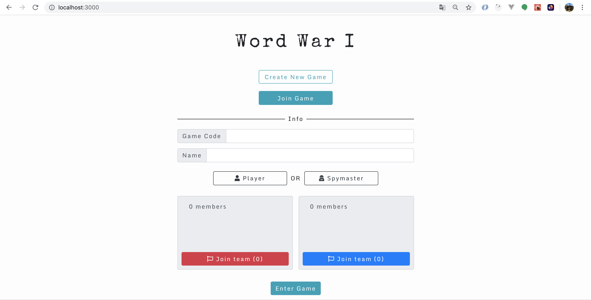
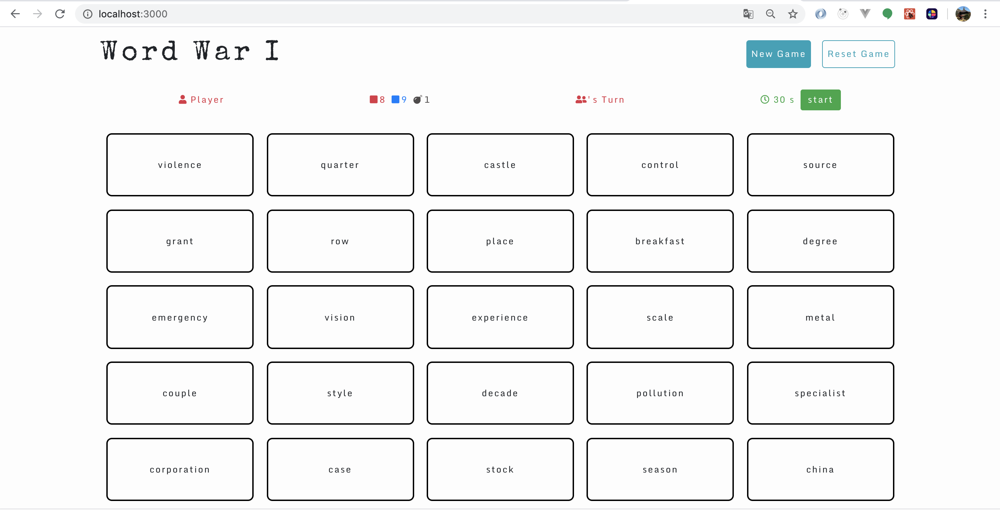

**- APP DEVELOPMENT STILL IN PROGRESS -**

## Description
We wanted to create an online game for people to play similar to the game "Codenames", while leveling up our coding skills at the same time! Rules section - coming soon!

## Screenshots
*Create Game Page*

*Game Board Page (player view)*

## Collaborators
- [Heather Hartley (Frontend)](https://github.com/hlhartley)
- [Lee Chow (Backend)](https://github.com/leepuppychow)

## Frontend Technologies
- React
- React Hooks

## Backend Technologies
- Python
- Websockets
- "Serverless" setup utilizing AWS services
- 2 API Gateways: HTTPS API Gateway --> Lambda --> RDS(Postgres) & Websocket API Gateway --> Lambda --> RDS(Postgres)

## Backend README
Link: https://github.com/hlhartley/hlhartley-word-war-1/tree/master/server

## ToDo:
- Make responsive and mobile friendly
- Add styling for Game Board (spymaster view)
- Connect Websockets
- User testing!!

## Future Iterations
- Add Timer functionality
