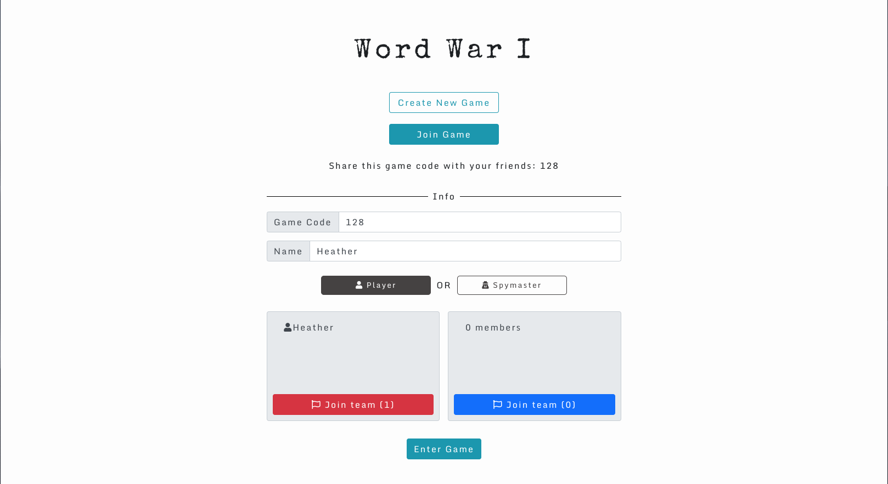
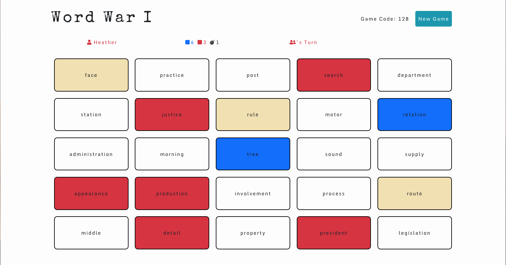
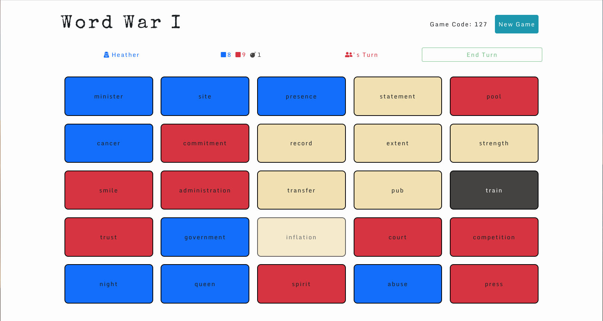

## Description
We wanted to create a strategic, fun, online game for people to play (especially during the COVID-19 pandemic), while leveling up our coding skills at the same time! Rules section - coming soon!

**We suspended the site temporarily due to AWS hosting costs**

~~[Play Game :)](https://ecstatic-lalande-0e780a.netlify.app/)~~

## Screenshots
*Create Game Page*

*Game Board Page (player view)*

*Game Board Page (spymaster view)*

## Collaborators
- [Heather Hartley (Frontend)](https://github.com/hlhartley)
- [Lee Chow (Backend)](https://github.com/leepuppychow)

## Technologies Used
- React (frontend)
- React Hooks (frontend)
- Netlify
- Python (backend)
- Websockets (frontend & backend)
- AWS: API Gateway (REST and WebSocket API), Lambda, RDS (PostgreSQL)
- Trello (for planning & organization)

## Backend README
Link: https://github.com/hlhartley/hlhartley-word-war-1/tree/master/server

## Future Iterations
- Refer to Issues
